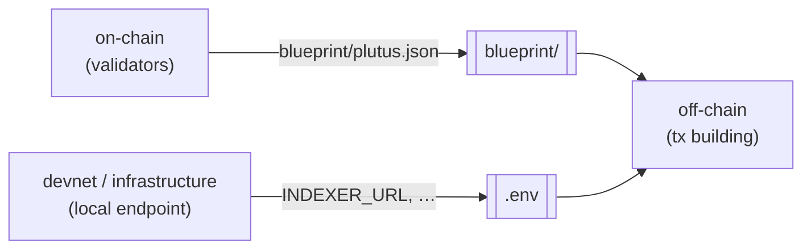

# cardano-init — User Documentation

How `cardano-init` works, how it fits into an agent workflow, how it relates to the rest of the Cardano tooling ecosystem, and the infrastructure providers it supports. For installation and quick start, see the [README](../README.md).

## How it works

You choose tools for **roles**. Only the directories for selected roles are created, and a base layer (top-level `Justfile`, README, `.env`, `blueprint/`) wires them together.

| Role | What it does | Multiple tools? |
|------|--------------|-----------------|
| `on-chain` | Validators / smart-contract logic; produces the CIP-57 blueprint | no |
| `off-chain` | Transaction building & submission | no |
| `devnet` | Local throwaway chain to develop & integration-test against | no |
| `infrastructure` | Indexers, node providers, chain followers | **yes** |
| `formal-methods` | Specification & verification | no |

The magic is the **interface contract**: on-chain components always emit `blueprint/plutus.json`, and whatever provisions a local endpoint writes standard vars (like `INDEXER_URL`) into `.env`. Consumers read those and degrade gracefully when blank. Because components talk to the *contract* rather than to each other, mixing and matching tools Just Works.



Every tool writes to and reads from those two seams (`blueprint/` and `.env`) — never from each other — so a swap on one side never breaks the other.

Every on-chain and off-chain template ships the **same worked example — a gift card**: a one-shot minting policy that mints a unique token gated by a specific UTxO, plus a `redeem` validator that releases a locked gift when the token is burned. Because all tools demonstrate the same scenario with a shared parameter ABI, a generated project builds and tests end-to-end, and any on-chain tool composes with any off-chain one (e.g. an Aiken contract driven by the Scalus off-chain, or a Scalus contract driven by the MeshJS off-chain).

**Fullstack tools.** Some tools (e.g. Scalus) implement both on-chain and off-chain in one language. Pick such a tool for both roles (e.g., `--fullstack scalus`, or `--on-chain scalus --off-chain scalus`) and instead of two folders you get a single unified **`protocol/`** component. It still writes the standard `blueprint/plutus.json` and reads `.env`, so it composes with devnet, formal-methods, and infrastructure.

**Compatibility checks.** Not every off-chain tool can talk to every provider and each devnet/infra provider serves some set of them. `cardano-init` knows these and **stops before generating** a project whose off-chain tool can't reach a chain from its selected providers. The error lists the providers that *would* work; pass `--ignore-warning` to scaffold the combination anyway. Interactive mode simply hides the incompatible options.

### Devnet providers

| Provider | Flag | Endpoint |
|----------|------|----------|
| Yaci DevKit | `--devnet yaci` | Blockfrost-compatible API and Yaci admin faucet |
| Dingo | `--devnet dingo` | Blockfrost-compatible API and local faucet command |

Dingo's generated `just test` starts a single-node Docker devnet, submits a
faucet transaction, verifies it through the Blockfrost API, and tears down.
`just dev` writes `INDEXER_URL` and `INDEXER_PORT` to the project `.env`.

## For coding agents

`cardano-init` is built to be driven by LLMs, end to end:

- **Machine-readable interface.** `cardano-init list --format json` enumerates every role and tool; any command accepts `--format json` and emits a stable envelope with machine-readable error `code`s and a `context` that says how to fix each error. One-shot mode (`--name …`) is fully non-interactive, so an agent can scaffold in a single call. See [TECH_SPEC](TECH_SPEC.md) §2.
- **Generated `AGENTS.md`.** Every project ships an `AGENTS.md` (plus a `CLAUDE.md` that imports it) tailored to the chosen stack: the layout, the interface contract and its invariants, the exact `just` workflow, per-tool official doc links, and the [cardano-dev-skills](https://github.com/cardano-foundation/cardano-dev-skills) most relevant to that stack. An agent dropped into a fresh project knows what it is and what to do next.
- **Works in tandem with [cardano-dev-skills](https://github.com/cardano-foundation/cardano-dev-skills).** That Cardano Foundation skill set is the *knowledge* layer (writing validators, building transactions, debugging on-chain failures); `cardano-init` is the *scaffolding* layer. The generated `AGENTS.md` points agents at the plugin and the right skills for the stack they're in.

## How it relates to `aikup`, `cardano-up`, and friends

`cardano-init` is a **project scaffolder**, not a version manager or an environment manager. It runs once, generates a wired-together monorepo, and steps out. That makes it complementary to (not a replacement for) the per-tool installers in the ecosystem.

These sit at different layers: `cardano-init` decides *what tools your project uses and how they compose*, while `aikup` / `cardano-up` install and manage *the toolchains and infrastructure those tools need*. The two meet at the dependency [`doctor`](ROADMAP.md): when toolchains are missing, `cardano-init` advises the right installer (`aikup` for Aiken, `cardano-up` for the infrastructure role) rather than reinventing them.

By design, `cardano-init` is **not** a package or version manager: it does not pin or upgrade tool versions, manage dependencies after generation, or migrate existing projects. There is no `cardano-init update`.

## Infrastructure providers

The **infrastructure** role is backed by [`cardano-up`](https://github.com/blinklabs-io/cardano-up) (requires Docker). Unlike the other roles, infrastructure is **multi-tool**: select any combination with repeated `--infra` flags and they are provisioned together as a single project-scoped `cardano-up` context, aggregated into one `infra/` component. Each provider publishes its connection details to the project `.env`, which off-chain components read automatically.

| Provider | Flag | Publishes to `.env` | Upstream |
|----------|------|---------------------|----------|
| Kupo | `--infra kupo` | `INDEXER_URL` | https://github.com/CardanoSolutions/kupo |
| Ogmios | `--infra ogmios` | `OGMIOS_URL` | https://ogmios.dev |
| Dolos | `--infra dolos` | `DOLOS_GRPC_URL`, `NODE_SOCKET_PATH` | https://github.com/txpipe/dolos |
| Tx Submit API | `--infra tx-submit-api` | `TX_SUBMIT_URL` | https://github.com/blinklabs-io/tx-submit-api |
| Cardano Node | `--infra cardano-node` | `NODE_SOCKET_PATH` | https://github.com/IntersectMBO/cardano-node |
| Cardano Node API | `--infra cardano-node-api` | `CARDANO_NODE_API_URL` | https://github.com/blinklabs-io/cardano-node-api |
| Dingo | `--infra dingo` | `INDEXER_URL`, `NODE_SOCKET_PATH` | https://github.com/blinklabs-io/dingo |

```bash
# An indexer + query bridge over a shared node (cardano-up pulls in cardano-node):
cardano-init --name my-protocol --off-chain meshjs --infra kupo --infra ogmios

# Bring the stack up (provisions the services and writes connection details into .env. Long-running):
just -f infra/Justfile dev
```

- **Dolos and Dingo are self-contained nodes**: No separate `cardano-node`. Each provides its own `NODE_SOCKET_PATH`, and Dingo also serves a Blockfrost-compatible API as `INDEXER_URL`.
- **One chain-index per project**: `INDEXER_URL` has a single slot, so Kupo and Dingo are alternatives, not additive.
